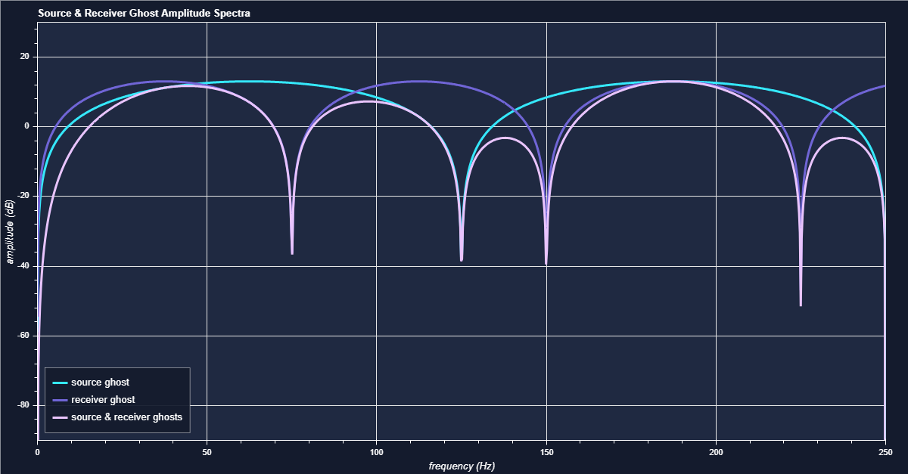

# Source & Receiver Ghosts

This example uses Python Bokeh to create an interactive HTML format plot showing the amplitude spectra for the source and receiver ghost reflections of marine seismic acquisition. For a little more background see [Ghosting as a notch filter](https://wiki.seg.org/wiki/Ghosting_as_a_notch_filter) or some of the other pages on ghosting on the [SEG Wiki](https://wiki.seg.org/wiki/Main_Page).

*click on the image to open the interactive version*

## ghosts.py

The main package used is Python [Bokeh](https://bokeh.org/) that creates interactive data visualisations for web browsers - it can output HTML format files.

Bokeh allows extensive customisation of both the appearance and the interactivity of the displays it produces.

Some of these visual features can be parameterised with the Bokeh `figure` parameters or many more can be directly modified by setting the `figure` properties. The appearance can be further changed by updating the output HTML CSS, either with the `Div` function or after the HTML is created using, for example, [Beautiful Soup](https://beautiful-soup-4.readthedocs.io/en/latest/).

The interactivity can be customised using Bokeh's built-in tools or by creating new tools using Bokeh elements and JavaScript.

There are examples of all of these customisations in ghosts.py so in addition to Python the file contains some CSS and JavaScript.
